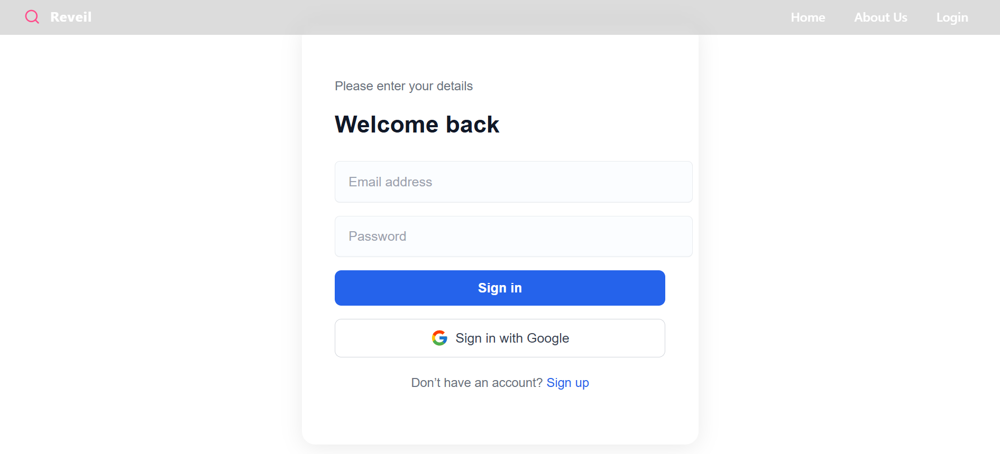
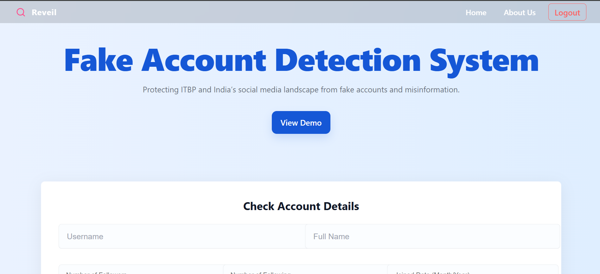

# 🎨 Reveil Frontend

The  is the **Reveil Frontend** .  
It handles user authentication, API requests, and provides an intuitive UI for users to interact with the FastAPI backend.

---
## 🧠 Tech Stack

| Category | Technology |
|:----------|:------------|
| Framework | React (Vite) |
| Styling | CSS |
| HTTP Client | Axios |
| Auth | JWT Tokens |
| Icons | Lucide React, React Icons |

---
## 🖼️ Screenshots

